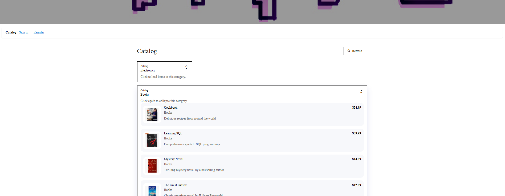

# AngularDemo

This is a Catalog app.  Here is what is looks like when getting the catalogs and the items in each catalog.



AngularDemo is a full-stack demo with:

- Frontend: Angular app in `demo-app`
- Backend: Express API in `API`

## Repository Structure

```text
AngularDemo/
  API/        # Express + SQL Server API
  demo-app/   # Angular frontend
```

## Prerequisites

- Node.js 20+ (recommended)
- npm 10+ (recommended)
- SQL Server (for catalog data)

## Quick Start

Open two terminals from the repository root.

### 1. Start the API

```bash
cd API
npm install
npm run dev
```

API health check:

- http://localhost:3000/health

### 2. Start the Angular app

```bash
cd demo-app
npm install
npm start
```

Frontend URL:

- http://localhost:4200

## Primary URLs

- App (Angular): http://localhost:4200
- API (Health): http://localhost:3000/health

Optional API data endpoint:

- API (Catalog): http://localhost:3000/api/catalog

## Single Command Startup

From repository root:

```bash
npm install
npm run install:all
npm run dev:all
```

This starts both services in one terminal:

- API: http://localhost:3000/health
- Frontend: http://localhost:4200

To stop both services (from another terminal):

```bash
npm run stop:all
```

If your terminal is inside `API` or `demo-app`, this also works:

```bash
npm run stop:all
```

## Environment Setup (API)

Use `API/.env.local` for local development values.

1. Copy the keys from `API/.env.example` into `API/.env.local`
2. Put your real SQL Server values in `API/.env.local`
3. Keep `API/.env.example` sanitized with placeholders only

## Running Tests

Tests are written with Jasmine and run via Karma inside the `demo-app` folder.

### Run all tests once

```bash
cd demo-app

ng test
npx ng test --no-progress --watch=false
```

### Run a single spec file

```bash
cd demo-app
npx ng test --include="src/app/catalog/catalog.component.spec.ts" --no-progress --watch=false
```

### Watch mode (re-runs on file changes)

```bash
cd demo-app
npx ng test
```

> **Note:** Always run `ng test` from inside the `demo-app` folder, not the repository root.

## To Run both API and the app

Root:

- `npm run install:all` - Install dependencies for API and frontend
- `npm run dev:all` - Start API and frontend together
- `npm run stop:all` - Stop API and frontend by closing ports 3000 and 4200

Any directory option:

- From root: `npm run stop:all`
- From `API`: `npm run stop:all`
- From `demo-app`: `npm run stop:all`

## To run API
API:

- `npm run dev` - Run API with nodemon
- `npm start` - Run API with node

## To run Frontend
Frontend:

- `npm start` - Start Angular dev server
- `npm run build` - Build Angular app
- `npm test` - Run unit tests

## Building The Whole App

Run Angular build in the `demo-app` folder:

```bash
cd demo-app
ng build
```

Or run from repository root:

```bash
npm run build --prefix demo-app
```

Note: `ng build` should be run against `demo-app` (the Angular workspace), not `API`.
